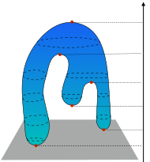
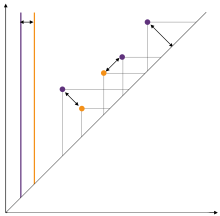
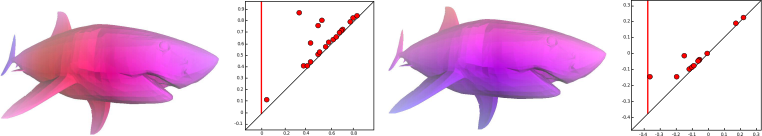
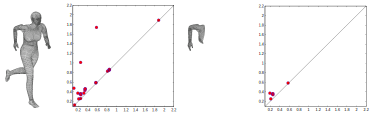
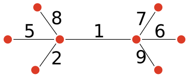
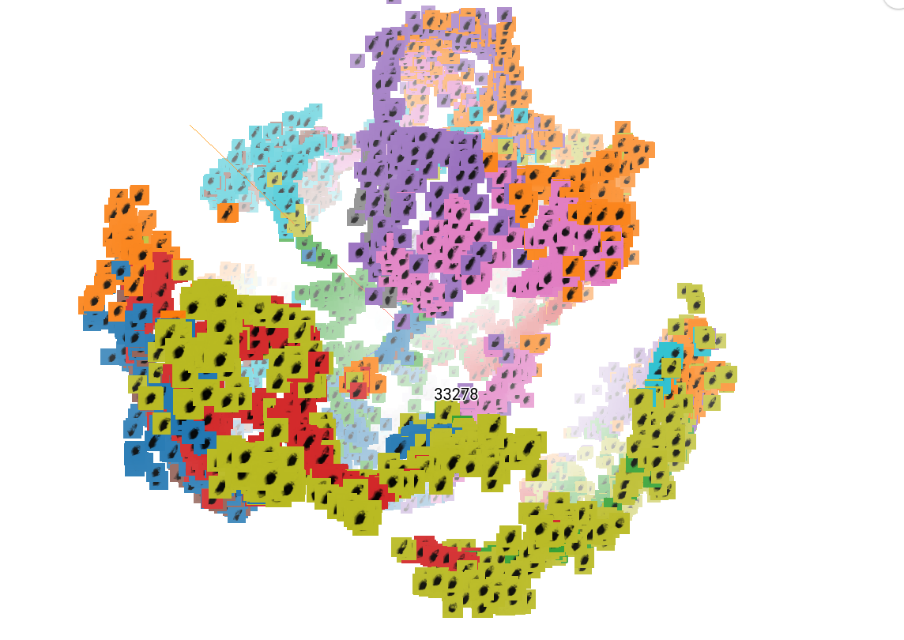
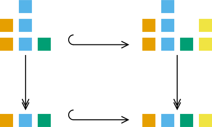
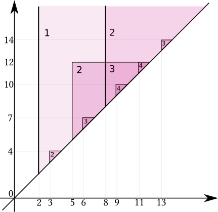

class: center, middle
background-image: url(assets/champalimaud.jpg)

<h1 class="almost_white">Multicolored persistence</h1>
<h2 class="almost_white">Mattia G. Bergomi, Pietro Vertechi</h2>
<h3 class="almost_white">Champalimaud Research</h3>

---

## Outline
- A recap and intuition on (non)-topological persistence

--

- Fundamentals of category theory:

    * definition of category, objects, morphisms, universal properties.

    * Abelian and semisimple categories.

--

- Generalizing persistent homology with the language of category theory

--

- Multicolored persistent homology:

    * Group actions of filtration of spaces

    * Labelled datasets

---
## Who else?

    
Massimo Ferri

    

    
Antonella Tavaglione

    

    
Lorenzo Zuffi

    

---

  

    <h3 style="float: left; text-align: center; width: 100%; margin-right: 1%; margin-bottom: 0.5em;">
      Classical framework
    </h3>
    

    $\mathbb{X}$ triangulable manifold, $f$ continuous. $\mathbb{X}_{i} = f^{-1}\left(\left(-\infty, a_i\right]\right)$
    $$
    \mathbb{X}_{1} \subseteq \cdots \subseteq \mathbb{X}_{n} = \mathbb{X}
    $$
    
    

  

  

--

  

    <h3 style="float: left; text-align: center; width: 100%; margin-right: 1%; margin-bottom: 0.5em;">
      (at least) 3 reasons why
    </h3>
    

      
Stability

    

    

      
Flexibility

    

    

      
Robustness

    

  

--

  

    <h3 style="float: left; text-align: center; width: 100%; margin-right: 1%; margin-bottom: 0.5em;">
      Limitations
    </h3>
    

      
Graphs

    

    

      
Quivers

    

    

      
Labelled point clouds

    

  

---
## An intuition on (non)-topological persistence

- Detect minimal ingredients
- Axiomatization
- Generalization
---
## Funky results from Beyond

---

## What is a category?

A category $\mathbf C$ is composed of some objects $\textnormal{Obj}(\mathbf C)$ and some morphisms $\textnormal{Morph}(\mathbf C)$ between objects:

$$A \xrightarrow{\phi} B$$

--

Morphisms need to obey some simple axioms:

- Given $A \xrightarrow{\phi} B \xrightarrow{\psi} C$, we have the composition $A \xrightarrow{\psi \circ \phi} C$.

- Any object $A$ has the identity morphism $A \xrightarrow{Id\_A} A$.

---

## Examples of categories.

Everything:
- Sets (morphisms are functions)
- Vector spaces (morphisms are linear functions)
- Groups (morphisms are group homomorphisms)
- $G$-representations (morphisms are $G$-equivariant linear maps)
- Topological spaces (morphisms are continuous functions)
- Simplicial complexes (morphisms are simplicial maps)
- Smooth manifolds (morphisms are smooth functions)
- ...

---

## Monomorphisms and epimorphisms

- A morphism $A \xrightarrow{\phi} B$ is monic if for all $X \overset{\chi}{\underset{\psi}\rightrightarrows} A$, $\psi\circ\phi = \chi\circ\phi$ implies $\psi = \chi$.

- A morphism $A \xrightarrow{\phi} B$ is epic if for all $B \overset{\chi}{\underset{\psi}\rightrightarrows} X$, $\phi\circ\psi = \phi\circ\chi$ implies $\psi = \chi$.

---

## Universal properties

It is common to define things in terms of so called universal properties. Let's work with the familiar category of sets:

- An object $\varnothing$ is initial if for any $X$ there is a unique morphism $\\varnothing \to X$: $\\{ \\}$

- An object $\textnormal{pt}$ is terminal if for any $X$ there is a unique morphism $X \to \textnormal{pt}$: $\\{0\\}$

- Given $A, B$ an object is the product $A \times B$ if a morphism $X \to A\times B$ is the same as a morphism $X \to A$ and a morphism $X \to B$: Cartesian product.

- Given $A, B$ an object is the coproduct $A \amalg B$ if a morphism $A\amalg B \to X$ is the same as a morphism $A \to X$ and a morphism $B \to X$: disjoint union.

---

## Universal properties

It is common to define things in terms of so called universal properties. Let's work with the familiar category of ~~sets~~ vector spaces:

- An object $\varnothing$ is initial if for any $X$ there is a unique morphism $\\varnothing \to X$: $0$

- An object $pt$ is terminal if for any $X$ there is a unique morphism $X \to pt$: $0$

- Given $A, B$ an object is the product $A \times B$ if a morphism $X \to A\times B$ is the same as a morphism $X \to A$ and a morphism $X \to B$: direct sum.

- Given $A, B$ an object is the coproduct $A \amalg B$ if a morphism $A\amalg B \to X$ is the same as a morphism $A \to X$ and a morphism $B \to X$: direct sum.

---

## The fundamental ingredients of persistence

Persistent homology requires a few basic ingredients:
- A filtration $X\_t$ in the category $\mathbf{Top}$.

--

- A functor $H\_k:\mathbf{Top} \to \mathbf{FinVec}$ (the homology in some degree).

--

- A measure of rank in the category $\mathbf{FinVec}$ (the dimension of the vector space).

--

## The recipe

- Start with a filtration of topological spaces $X\_t$.

- Obtain vector spaces $H\_k(X\_t)$ with linear maps $H\_k(X\_s)) \to H\_k(X\_t))$ for $s \le t$.

- Consider the persistent homology spaces $im(H\_k(X\_s) \to H\_k(X\_t))$.

- Compute the the persistent Betti numbers $dim(im(H\_k(X\_s) \to H\_k(X\_t))$.

---

## Rank function generalizes dimension of vector spaces and cardinality of sets

Let us take a regular category $\mathbf R$ and a function $r: \textnormal{Obj}(\mathbf R) \to \mathbb Z$. We say that $r$ is a rank function if:

- for any monomorphism $A \hookrightarrow B$, $r(A) \le r(B)$

- for any regular epimorphism $A \twoheadrightarrow C$, $r(A) \ge r(C)$

- given a pullback square:

the following inequality holds

$$r(B) - r(D) \ge r(A) - r(C)$$

---

## Explaining the pullback condition

- If we restrict a surjection, the excess of the domain over the codomain is reduced.

- Always true if the excess is the sum of the excesses along the fibers: in that case we say the rank is fiber-wise.

---

## Examples of fiber-wise rank functions

- Cardinality in $\mathbf{FinSet}$

- Dimension in $\mathbf{FinVec}\_\mathbb{K}$

- In an Abelian category, length of composition series of an object:
$$0 \simeq X\_0 \hookrightarrow X\_1 \hookrightarrow \dots \hookrightarrow X\_n \simeq A$$ where all $X\_{i+1}/X\_i$ are simple.

- Any non-negative "exact" function in an Abelian category, i.e. such that $r(0) = 0$ and for all short exact sequence $X \to Y \to Z$, $r(Y) = r(X) + r(Z)$

---

## Categorical persistence function

__Properties of persistent Betti numbers__

Given $u\_1\le u\_2 \le v\_1 \le v\_2$:
- $p(u\_1, v\_1) \le p(u\_2, v\_1)$ and $p(u\_2, v\_2) \le p(u\_2, v\_1)$

- $p(u\_2, v\_1) - p(u\_1, v\_1) \ge p(u\_2, v\_2) - p(u\_1, v\_2)$

--

__Definition__ (Categorical persistence function).
$p:\textnormal{Morph}(\mathbf C) \to \mathbb Z$ such that, given $u\_1\to u\_2 \to v\_1 \to v\_2$:
- $p(u\_1 \to v\_1) \le p(u\_2 \to v\_1)$ and $p(u\_2 \to v\_2) \le p(u\_2 \to v\_1)$

- $p(u\_2 \to v\_1) - p(u\_1 \to v\_1) \ge p(u\_2 \to v\_2) - p(u\_1 \to v\_2)$

We recover the original definition when $\mathbf C = (\mathbb R, \le)$.

---

## Categorical persistence function

**From a rank**

Given a rank $r:\textnormal{Obj}(\mathbf C) \to \mathbb Z$, the rank of the image of a morphism $\phi \mapsto r(im(\phi))$ is a categorical persistence function:
- cardinality of the image of a function between sets.
- rank of a morphism between vector spaces.
- length of the image of a morphism in an Abelian category.

--

**From another categorical persistence function**

Given a categorical persistence function $p$ in $\mathbf D$ and a functor $F:\mathbf C \to \mathbf D$, $p\circ F$ is a categorical persistence function in $\mathbf C$:
- $H\_k: \mathbf{FinSimp} \to \mathbf{FinVec}$ defines a persistence function in $\mathbf{FinSimp}$.
- $Blocks: \mathbf{FinGraph} \to \mathbf{FinSet}$ defines a persistence function in $\mathbf{FinGraph}$.

---

## Back to the classical case

A categorical persistence function $p:\textnormal{Morph}(\mathbf C) \to \mathbb Z$ and a functor $(\mathbb R, \le) \to \mathbf C$ induce a categorical persistence function on $(\mathbb R, \le)$, the classical case.

Functors $(\mathbb R, \le) \to \mathbf C$, i.e. $(\mathbb R, \le)$-indexed diagrams in $\mathbf C$, generalize filtrations: inclusion maps are no longer required to be monomorphisms.

--

<table>
<thead>
<tr>
    <th>Classical framework</th>
    <th>Categorical framework</th>
</tr>
</thead>
<tbody>
<tr>
    <td>Topological spaces</td>
    <td>Source category $\mathbf C$</td>
</tr>
<tr>
    <td>Vector spaces</td>
    <td>Regular target category $\mathbf R$</td>
</tr>
<tr>
    <td>Dimension</td>
    <td>Rank function on $\mathbf R$</td>
</tr>
<tr>
    <td>Homology functor</td>
    <td>Arbitrary functor $\mathbf C \to \mathbf R$</td>
</tr>
<tr>
    <td>Filtration of topological spaces</td>
    <td>$(\mathbb R, \le)$-indexed diagram in $\mathbf C$</td>
</tr>
</tbody>
</table>

---

## Persistence diagram

Given a persistence function $p:\textnormal{Morph}(\mathbf{C})\to \mathbb Z$, and a functor $F:(\mathbb R, \le) \to \mathbf{C}$ we can define:

\\[ p\_F: \Delta^+ \to \mathbb Z \\]
\\[ (u, v) \mapsto p(F(u \le v)) \\]

--

**Definition** Given $p\_F$ as above, we can define the cornerpoint multiplicity of $u < v$ as:
$$ \mu(u, v) = \min p\_F(\beta, \gamma)-p\_F(\alpha, \gamma) - p\_F(\beta, \delta)+p\_F(\alpha, \delta)$$

where the minimum is taken over $\alpha, \beta, \gamma, \delta$ respecting $\alpha < u < \beta$ and $\gamma < v < \delta$.

<!-- In practice, the condition $p(u\_2 \to v\_1) - p(u\_1 \to v\_1) \ge p(u\_2 \to v\_2) - p(u\_1 \to v\_2)$ on persistence functions ensures that the tightest the above inequalities are, the smallest the right-hand side is.-->

--

**Remark** More generally, $p\_F(\beta, \gamma)-p\_F(\alpha, \gamma) - p\_F(\beta, \delta)+p\_F(\alpha, \delta)$ denotes the sum of multiplicities of cornerpoints inside the rectangle $(\alpha, \beta] \times (\gamma, \delta]$ (technical assumption: $\alpha, \beta, \gamma, \delta$ must be right-regular).

--

**Definition** We denote $\mathcal{D}F$ the persistence diagram of $F$ (cornerpoints with multiplicity).

---

## Persistence diagram for semisimple categories

  

    </img>
  

---
count: false
## Persistence diagram for semisimple categories

  

    </img>
  

  

    

      For semisimple Abelian categories with rank function $length$, the persistence diagram
      is informative about the decomposition of a tame $(\mathbb R, \le)$-indexed diagram.
    

    

      In $\mathbf{R}^{(\mathbb R, \le)}$ we have "interval objects" of the type:
      

        $$
        \chi_{I, S}(a)  = \begin{cases}{}
            S&\text{if } a \in I\\
            0 &\text{otherwise}
        \end{cases}
        $$

        $$
        \chi_{I, S}(a \le b) = \begin{cases}{}
            \textnormal{Id}_S&\text{if } a, b \in I\\
            0 &\text{otherwise}
        \end{cases}
        $$
      

      for $I$ an interval and $S$ a simple object of $\mathbf{R}$.
    

    <ul>
      <li>Tame $(\mathbb R, \le)$-indexed diagram are finite sums of interval objects.</li>
      <li>The interval extrema, with multiplicity, are given by the persistence diagram.</li>
    </ul>
  

---

## Interleaving and bottleneck distances

Interleaving and bottleneck distance can be defined as in the classical theory.

**Definition** Two functors $F, G:(\mathbb R, \le) \to \mathbf{C}$ are $\epsilon$-interleaved if there are natural transformations
$$F\to GT\_\epsilon$$
$$G\to FT\_\epsilon$$

where $T\_\epsilon$ is the translation functor $x \mapsto x+\epsilon$, such that the following diagrams commute

The interleaving distance is the infimum of $\epsilon$ values such that $F$ and $G$ are $\epsilon$-interleaved.

---

## Interleaving and bottleneck distances

Bottleneck distance is define as usual in terms of persistence diagrams, as the infimum $l\_\infty$ distance of bijections of $\mathcal{D}F$ and $\mathcal{D}G$

**Theorem** (Stability) Given a category $\mathbf{C}$ with finite colimits, a persistence function $p$ on $\mathbf{C}$ and two tame $(\mathbb R,\le)$-indexed diagrams $F, G:(\mathbb R, \le) \to \mathbf{C}$, the interleaving distance between $F,G$ is greater or equal than the bottleneck distance:

$$d\_\mathbf{C}(F, G) \ge d(\mathcal{D}F, \mathcal{D}G)$$

--

**Theorem** (Tightness) Given a semisimple Abelian category $\mathbf{R}$ with essentially one simple object and the persistence function $\phi \mapsto length(im(\phi))$, interleaving and bottleneck distances are equal on tame $(\mathbb R, \le)$-indexed diagrams.

**Remark** Theorem (Tightness) generalizes the classical result on $\mathbf{R}=\mathbf{FinVec}\_\mathbb{K}$. We need the hypothesis "essentially one simple object", as two constant filtrations of non-isomorphic simple objects would have infinite interleaving distance and bottleneck distance equal to $0$.

---

## Multicolored persistence

Bottleneck distance is not very informative in categories with many non-isomorphic simple objects. We can refine it by coloring the persistence diagram.

Given a ranked category $(\mathbf{R}, r)$ (i.e. $\mathbf{R}$ is regular and $r$ is a rank function) and a family of ranked categories $(\mathbf{R}\_\gamma, r\_\gamma)$,  a coloring is a family of functors $\mathcal{C}\_\gamma:\mathbf{R}\to \mathbf{R}\_\gamma$ such that:

- The natural map $\textnormal{Hom}\_\mathbf{R}(X, Y) \to \prod\_{\gamma} \textnormal{Hom}\_{\mathbf{R}\_\gamma}(\mathcal{C}\_\gamma(X), \mathcal{C}\_\gamma(Y))$ is bijective.

- The rank function $r$ is the sum of its components: $r(X) = \sum\_\gamma r\_\gamma(\mathcal{C}\_\gamma(X))$
